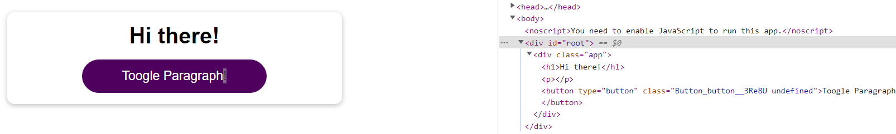
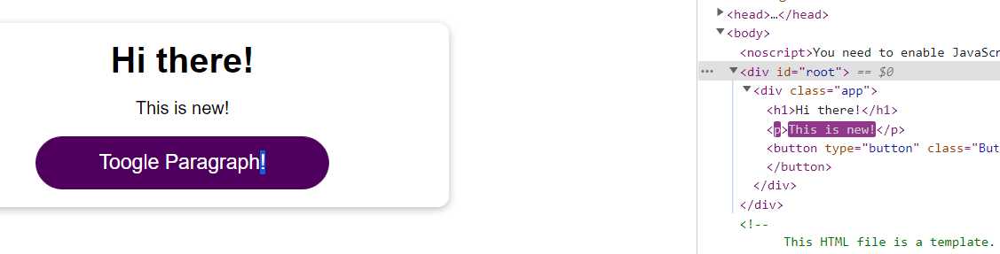
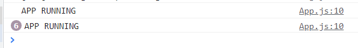
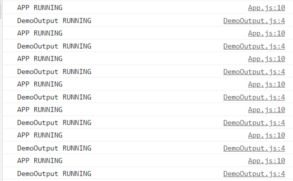
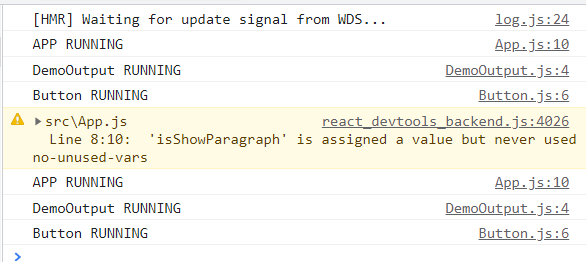
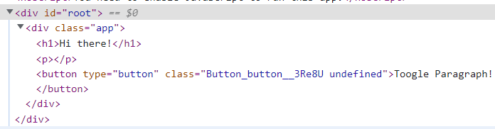
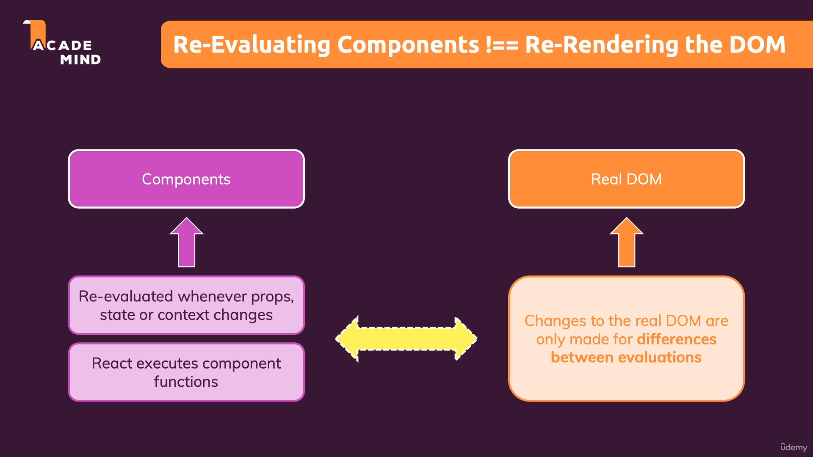

# Child Component Re-Evalution

Sekarang kita akan membahas tentang `Child Component Re-Evalution` pada suatu component yang memiliki component lain sebagai childnya. Untuk itu kita akan lihat dua file component dibawah ini:

`a. Children Component`
```ts
import React from 'react';

const DemoOutput = (props) => {
    return <p>{props.show ? 'This is new!' : ''}</p>
};

export default DemoOutput;
```

`b. Parent Component`
```ts
import React, { useState } from 'react';
import Button from './components/UI/Button/Button';

import './App.css';
import DemoOutput from './components/Demo/DemoOutput';

function App() {
  const [isShowParagraph, setIsShowParagraph] = useState(false);

  console.log('APP RUNNING');

  const togglePargraphHandler = () => {
    setIsShowParagraph(prevIsShowParagraph => !prevIsShowParagraph);
  };

  return (
    <div className="app">
      <h1>Hi there!</h1>
      // Below using children component
      <DemoOutput show={isShowParagraph} />
      <Button onClick={togglePargraphHandler}>Toogle Paragraph!</Button>
    </div>
  );
}

export default App;
```

## A. Parent Children Component Relation using State as Prop 

Pertama - tama kita akan melihat perubahan ketika menggunakan child component dan kita bisa melihat ketika kita melakukan trigger perubahan seperti sebelumnya dan bisa kita lihat dibawah ini:



Kita bisa melihat bahwa element `p` sudah ada terlebih dahulu hal ini dikarenakan pada child component element `p` memang sudah ditampilkan dan hanya `content dari p` nya saja yang tergantung dari props yang ada.



Kemudian pada gambar diatas bisa kita lihat bahwa hanya pada element `p` yang terjadi flashing dikarenakan berarti `Benar bahwa React dapat mengetahui di elemen mana perbedaan terjadi dan melakukan update pada tempat yang hanya diperlukan`.



Ada hal lain yang perlu diperhatikan yaitu pada tab `Console`, dapat kita lihat bahwa `console log` yang kita lakukan terjadi selama kita melakukan click padahal yang terupdate adalah children component. `Ada yang perlu kita tahu bahwa walaupun yang terjadi perubahan pada elemen adalah children component, maka parent component tidak akan di re-evaluate.`

Bisa kita lihat bahwa state yang digunakan sebagai props children component adalah state dari parentnya. dan sesuai konsep yang kita tahu dalam react, `ketika state atau context dari suatu component maka dia akan di re evaluate.`

Dan jika kita menambahkan console log pada children componentnya maka dia akan berjalan sejalan dengan console log dari parentnya.



## B. Parent Children Component Hard Code Props Evalution

Kita akan melakukan suatu percobaan yang berbeda dari sebelumnya yaitu bagaimana jika props yang digunakan akan kita hard code seperti dibawah ini:

```ts
import React, { useState } from 'react';
import Button from './components/UI/Button/Button';

import './App.css';
import DemoOutput from './components/Demo/DemoOutput';

function App() {
  const [isShowParagraph, setIsShowParagraph] = useState(false);

  console.log('APP RUNNING');

  const togglePargraphHandler = () => {
    setIsShowParagraph(prevIsShowParagraph => !prevIsShowParagraph);
  };

  return (
    <div className="app">
      <h1>Hi there!</h1>
      // Hard code false
      <DemoOutput show={false} />
      <Button onClick={togglePargraphHandler}>Toogle Paragraph!</Button>
    </div>
  );
}

export default App;

```

Yang mungkin kita pikirkan childrennya tidak akan di re-evaluate kembali karena `nilai props` nya tidak berubah yaitu tetap `false`. Tetapi pada nyatanya `children componentnya tetap dirender ulang`. Hal ini terjadi karena `state dari parentnya berubah dan code dari parent akan di re evaluate termasuk children yang ada di fungsi returnnya`.

Dan jika kita ingin membuktikan ini lebih dalam kita akan menambahkan console log didalam component lainnya yaitu dalam kasus ini adalah button.
Dan  hasilnya akan seperti dibawah ini:



`Gambar diatas menunjukkan bahkan hingga children lainnya juga melakukan re-evaluate.` 

Hal ini membuktikan konsep bahwa `Re-Evaluating Components !== Re-rendering the DOM`. Tetapi kita bisa lihat pada tab elementnya tidak ada element `flashing`. 






## C. Apa efek dari Re-Evaluate dari Children Component hingga Children yang lebih bawah ?

Kita jadi berpikir bahwa bukankah ini menjadi hal buruk karena semakin panjang childrennya dan kemudian terjadi update pada satu parent saja, maka banyak component dibawahnya melakukan re-evaluate.

Re-evaluate dan diff comparisan yang semakin banyak maka akan membuat performance yang lebih berat. `Sehingga seperti jika tidak ada perubahan props pada suatu children maka seharusanya dia tidak melakukan re-evaluate.`

### [Back To React Index](../../README.md)

