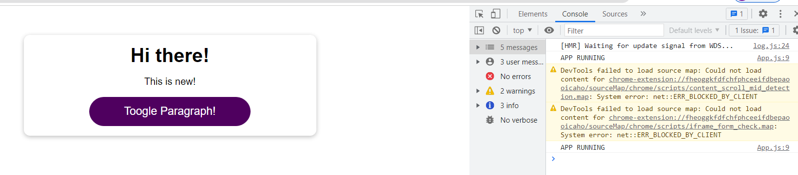
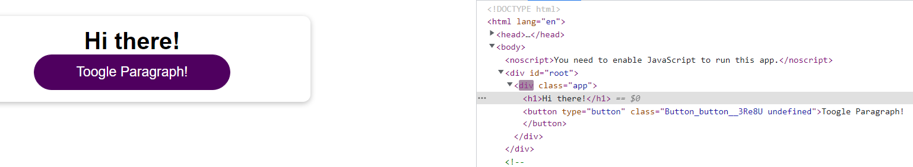

# Components Update in Action


Kita sudah melihat ilustrasi pada chapter sebelumnya tentang Virtual DOM Diffing. Dan pada chapter ini akan ditunjukkan bagaimana `Components Update` benar-benar terjadi.

## A. Practice Code

```ts
import React, { useState } from 'react';
import Button from './components/UI/Button/Button';

import './App.css';

function App() {
  const [isShowParagraph, setIsShowParagraph] = useState(false);

  console.log('APP RUNNING');

  const togglePargraphHandler = () => {
    setIsShowParagraph(prevIsShowParagraph => !prevIsShowParagraph);
  };

  return (
    <div className="app">
      <h1>Hi there!</h1>
      {isShowParagraph && (<p>This is new!</p>)}
      <Button onClick={togglePargraphHandler}>Toogle Paragraph!</Button>
    </div>
  );
}

export default App;
```

Kita mempunyai aplikasi diatas dimana kita mencoba membuat aplikasi seperti ilustrasi. Kita bisa lihat bahwa kita menggunakan button untuk melakukan show dan hide `new paragraph`, kita juga menggunakan state untuk menyimpan status show dan hidenya. Selain itu kita juga memberikan console.log. Mari kita lihat bagaimana hasil `running` aplikasi tersebut.

## B. Hasil Running

### 1. Components


Kita bisa melihat dari gambar diatas bahwa console log berjalan ketika aplikasi dijalankan kemudian kita akan coba menekan button Toogle Paragraph.



`Dan kita bisa lihat console log berjalan lagi hal ini membuktikan ketika ada perubahan state, props dan context maka components dimana yang mengalami perubahan akan dijalankan lagi kembali`.

### 2. Real DOM

Sedangkan bagaimana dengan Real DOM ?. Untuk melihat apa yang terjadi pada Real DOM kita akan membuka tab elements pada web browser kita.

Ketika kita menjalankan aplikasi untuk pertama kali kita akan melihat seperti dibawah ini:


Kemudian kita akan menekan button toogle paragraph dan kita bisa lihat di tab elements kita akan muncul paragraph baru dan munculnya disertai dengan `flash`. `Flash ini menunjukkan element mana yang melakukan rerender atau update`.


Hal ini menunjukkan bahwa element `p` yang hanya dirender tetapi tidak dengan h1 maupun div nya. Kemudian kita akan menekan kembali button tersebut dan sekarang yang menunjukkan flash adalah `div` nya.



Div melakukan update karena hanya disana paragraphnya diremove.

`Yang artinya adalah hal ini menunjukkan hanya perbedaan antara virtual snapshots yang akan dilakukan updatenya menuju real DOM.` 

Hal ini sangat penting untuk diperhatikan!

### [Back To React Index](../../README.md)
