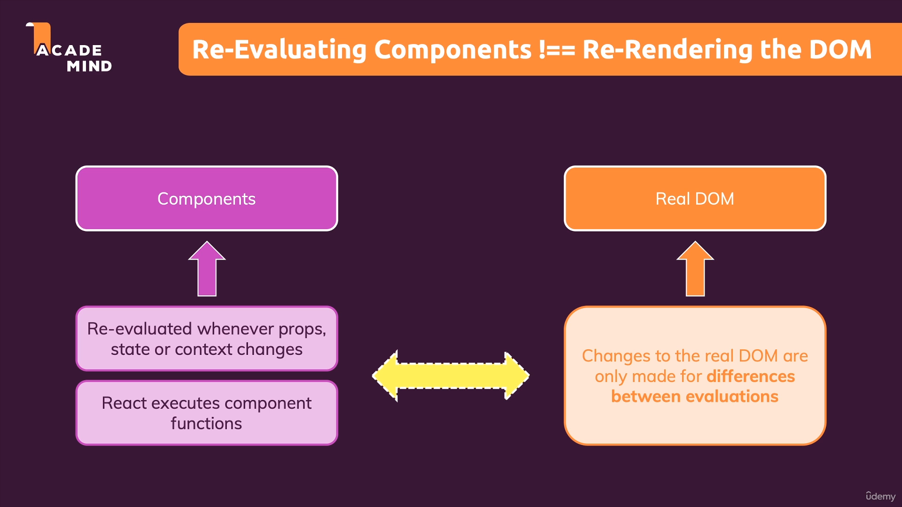

# Bagaimana React bekerja dibalik layar ?

## 1. React and ReactDOM

Sebelum membahas tentang apa yang terjadi dibalik layar dari React kita akan membahas dari awal terlebih dahulu. Kita sudah tahu bahwa `React adalah sebuah library javascript yang digunakan untuk membuat user interfaces`. Dan kita tahu bahwa React adalah selalu tentang `Components`. Kemudian React mengambil konsep komponen ini dan secara efektif membangun dan mengupdate user interfaces.

Ada hal lain yang sudah kenali yaitu `ReactDOM`, yaitu adalah interface sebenarnya terhadap web. React sendiri tidak mengenali soal web maupun tentang browser. React tahu caranya bekerja dengan components tetapi React tidak peduli dengan komponennya berisi elemen HTML atau element fictional. `Hanya ReactDOM yang penting karena dia yang tugas utamanya adalah membawa element HTML sesungguhnya terhadap layar.`

Tetapi yang perlu kita ingat adalah React adalah library yang bertugas melakukan manage komponen, state dan bercama state pada komponen, hal ini yang membuat `React` tahu bagaimana komponen yang dia punya mungkin perlu suatu `update` berdasarkan perubahan yang ada dari previous state dengan current state. `React memberikan semua informasi tentang semua perubahan tersebut dan apa yang seharusnya terlihat di screen.`

 

 

Untuk menjelaskan lebih detail kita bisa lihat ilustrasi diatas. Kita bisa melihat React mendapat informasi mulai dari `State (Internal Data), Context (Component Wide Data) dan Props (Data from parent component)`. Kemudian `React` akan menentukan apakah komponen tersebut sekarang perlu menampilkan sesuatu di screen. Dan jika iya `React` akan memberi tahu `ReactDOM`, sehingga `ReactDOM` dapat menampilkan hal baru itu kedalam screen.

 

## 2. Perkenalan Virtual DOM

Untuk memperjelas bagaimana hal ini terjadi kita akan mengenal yang dinamakan dengan `Virtual DOM`. Bisa kita lihat ilustrasi dibawah bahwa React hanya mengerti tentang Components dan kemudian React menggunakan konsep `Virtual DOM`. `Virtual DOM` ini yang menentukan bagaimanan `component tree` sekarang `terlihat seperti apa` dan seharusnya `akan menjadi seperti apa`. Contohnya adalah ketika adanya perubahan state update. Dan data tersebut akan di kirimkan ke `ReactDOM` yang dimana dia sekarang mengetahui perbedaan antara sekarang `terlihat seperti apa` dan seharusnya `akan menjadi seperti apa` yang membuatnya tahu harus memanipulasi `real DOM` seperti bagaimana agar sama dengan `Virtual DOM`.

 

 

Penjelasan lebih dalam : https://medium.com/@ekowahyus/react-virtual-dom-40e0e2781652

 

## 3. Re-Evaluating Components !== Re-Rendering the DOM

Kita harus mengetahui bahwa Re-Evaluating Components itu tidak sama dengan Re-rendering DOM. Kita tahu bahwa components akan di Re-evaluate ketika semisal ada perubahan state dan akan di Re-execute oleh React tetapi bukan berarti bahwa DOM nya juga akan di Re-render atau di Re-evaluate. Jadi kita harus membedakan antara bagian React dan Real DOM. Perubahan pada components hanya akan terjadi ketika ada perubahan props, state atau context dan hal ini akan melakukan trigger re-evaluates component functions. Sedangkan perubahan Real DOM hanya terjadi pada `perbedaan beberapa bagian` diantara `evaluations` previous state dan current state yang diberikan informasinya oleh React.

Jadi perubahan Real DOM sangat jarang terjadi dan hanya akan terjadi ketika dibutuhkan dan hal ini sangat penting bagi performance karena melakukan perubahan Real DOM membutuhkan performance yang `cukup besar`. Sedangkan untuk melakukan perbandingan pada virtual DOM ketika ada perubahan state hanya membutuhkan `performance yang ringan karena hanya terjadi didalam memory`.

 

## 4. Virtual DOM Diffing

Seperti yang dijelaskan sebelumnya Virtual DOM menyimpan perubahan sebelumnya dan yang sekarang terjadi. Pada ilustrasi diatas kita bisa lihat bahwa pada evalution sebelumnya hanya ada `div` dan didalamnya terdapat hanya ada satu `h1`. Kemudian karena ada perubahan state evalution sekarang berubah dengan ditambahnya satu `p` didalam div tersebut. Karena perubahan pada virtual DOM yang terjadi dibutuhkan suatu perubahan pada Real DOM. React akan memberitahu Real DOM tentang perubahan ini tetapi Real DOM `tidak akan merender semua komponen yang ada`, perubahan yang dilakukan hanya melakukan insert `p` kedalam DOM dan yang lainnya tetap sama.

### [Back To React Index](../../README.md)
