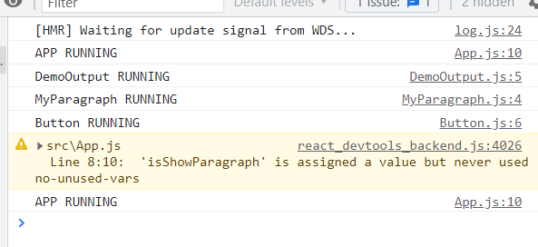

# Mencegah Function Re-Cretaion dengan useCallback

## 1. Apa itu useCallback ?

useCallback adalah react hooks yang digunakan untuk menyimpan suatu function sepanjang eksekusi component. Jadi dengan react hooks ini kita memberitahu kepada react bahwa kita tidak ingin re-create suatu function sepanjang setiap execution. Sehingga ketika function tersebut disimpan dalam suatu memory yang sama dan dilakukan comparison hasilnya akan selalu sama.

Secara gampang ilustrasinya adalah seperti ini

```js
let obj1 = {};
let obj2 = obj1;

obj1 === obj2 // true
```

## 2. Bagaimaana cara menggunakan useCallback ?

Untuk menggunakan useCallback kita bisa gunakan seperti dibawah ini:

```ts
const togglePargraphHandler = useCallback(() => {
    setIsShowParagraph(prevIsShowParagraph => !prevIsShowParagraph);
  }, []);
```

Dari code diatas kita memberitahu React untuk menyimpan function tersebut kedalam suatu internal storagenya dan menyimpannnya dan ketika dipanggil React akan mencarikan function tersebut untuk digunakan.

Sama seperti useEffect kita juga bisa memberikan dependencies yang kita gunakan didalam functionnya kedalam useCallbacknya. Dependencies yang dimaksud adalah seperti states maupun props atau bahkan context.

## 3. Hasil Optimisasi useCallback pada Button

Hasilnya adalah seperti dibawah ini button nya tidak di re-evaluate:



### [Back To React Index](../../README.md)
