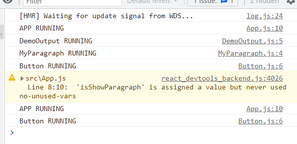

# Mencegah Re-evalution Tidak Perlu Menggunakan React Memo

Kita sudah mengetahu dari pembelajaran sebelumnya bahwa memang re-evalution dan diff comparison memakan performance. Untuk aplikasi yang kecil memang kita tidak terlalu memperdulikan tentang performance tetapi untuk aplikasi yang lebih besar hal ini akan mempengaruhi. Pada React sudah sangat highly optimize untuk masalah re-evaluasi dan diff comparison maka dari itu kita harus memberitahu React bahwa `kita hanya ingin suatu component re-evalute ketika berada dalam suatu kondisi`.

Contohnya adalah code dibawah ini:

```ts
function App() {
  const [isShowParagraph, setIsShowParagraph] = useState(false);

  console.log('APP RUNNING');

  const togglePargraphHandler = () => {
    setIsShowParagraph(prevIsShowParagraph => !prevIsShowParagraph);
  };

  return (
    <div className="app">
      <h1>Hi there!</h1>
      <DemoOutput show={false} />
      <Button onClick={togglePargraphHandler}>Toogle Paragraph!</Button>
    </div>
  );
}
```

```ts
const DemoOutput = (props) => {
    console.log('DemoOutput RUNNING');
    return <MyParagraph>{props.show ? 'This is new!' : ''}</MyParagraph>
};

export default DemoOutput;
```

Pada component Demoutput contohnya kita hanya ingin component ini re-evaluateo`.

```ts
const DemoOutput = (props) => {
    console.log('DemoOutput RUNNING');
    return <MyParagraph>{props.show ? 'This is new!' : ''}</MyParagraph>
};

export default React.memo(DemoOutput);
```

## 1. Apa yang React.memo lakukan ?

React.memo membuat kita dapat melakukan optimisasi pada functional components. React.memo memberitahu React untuk component ini dimana dia menerima component ini sebagaii argumentnya `( React.memo(DemOutput) )`, React harus melihat semua `props` yang component ini dapat dan check value baru dibandingkan dengan value lamanya. Dan jika hanya ada perubahan value dari props nya maka komponen akan di eksekusi kembali dan di re-evaluate.

`Maka dari itu jika component parentnya mengalami re-evaluate tetapi nilai props disini tidak ada perubahan maka component execution disini akan di skip.`


Bisa kita lihat hasil perubahan state pada parent tidak membuat component DemoOutput melakukan eksekusi kembali karena tidak ada perubahan nilai props. Selain itu child dari DemoOutput yaitu MyParagraph juga tidak di eksekusi kembali. `Dengan melakukan hal ini kita sudah melakukan sebuah optimisasi.`

## 2. Mengapa tidak semua component kita berikan React.memo ?

Karena optimisasi ini juga ada cost nya. Memo disini memberitahu React bahwa ketika ada perubahan pada parentnya maka pada children yang memakai React.memo dia harus melakukan komparasi nilai value propsnya. Sehingga React perlu melakukan dua hal yaitu `perlu menyimpan nilai lama props nya` dan `perlu melakukan komparasi`.

Kita juga perlu mempertimbangkan apakah kita harus menggunakan Memo pada suatu component karena kita menukar performance cost dari `Re-evaluating Component` menjadi `Comparing Props`. Dan tidak mungkin untuk mengetahui performance cost yang mana yang nantinya menjadi lebih besar karena tergantung sebanyak apa propsnya, sekompleks apa komponennya dan berapa banyak child component yang dimiliki.

Tetapi tetap saja jika kita memliki aplikasi yang besar dan memiliki component tree yang sangat besar maka pada level cabang yang tinggi kita bisa menggunakan memo agar mengurangi re-evaluasi yang tidak perlu.

Contoh simpelnya adalah dengan kita memotong pada `tingkat` DemoOutput kita sudah memotong re-evaluasi pada MyParagraph.

`Sedangkan pada Component yang memang selalu berubah mengikuti perubahan dari parentnya dimana bahkan hampir setiap re-evalution berubah maka React.memo tidak perlu untuk digunakan.`

Intinya adalah kita harus mengetahui dimana bagian penting dari branch component tree kita bisa mengurangi re-evalution yang tidak perlu dari childrennya.

## 3. Component dengan Props sebuah Function

```ts
function App() {
  const [isShowParagraph, setIsShowParagraph] = useState(false);

  console.log('APP RUNNING');

  const togglePargraphHandler = () => {
    setIsShowParagraph(prevIsShowParagraph => !prevIsShowParagraph);
  };

  return (
    <div className="app">
      <h1>Hi there!</h1>
      <DemoOutput show={false} />
      // Button with no signifance change on Props
      <Button onClick={togglePargraphHandler}>Toogle Paragraph!</Button>
    </div>
  );
}
```

Kita akan mencoba memberikan React.memo pada button diatas karena kita bisa lihat dia menerima content yang selalu sama dan function yang selalu sama

```ts
const Button = (props) => {
  console.log('Button RUNNING');
  return (
    <button
      type={props.type || 'button'}
      className={`${classes.button} ${props.className}`}
      onClick={props.onClick}
      disabled={props.disabled}
    >
      {props.children}
    </button>
  );
};

export default React.memo(Button);
```

Tetapi kita jalankan hasilnya seperti dibawah ini:



Hasilnya adalah button yang sudah kita memo tetap di re-evaluasi ?

Untuk mengetahui alasannya adalah kita harus lihat kembali code pada `App`. Kita bisa lihat bahwa button menerima hanya dua props yaitu `onClick` dan children. Tetapi kedua valuenya sebenarnya tidak berubah. `Hal ini sering sekali membuat developer React kebingungan.` 

Sekarang kita lihat pada App ketika adanya perubahan state maka semua code nya akan melakukan eksekusi kembali termasuk dengan function `toggleParagraphHandler` dan yang perlu kita tahu ketika ada nya re-evalution kembali dan render `maka function tersebut bukanlah function yang sama lagi seperti sebelumnya.` Function tersebut adalah function baru yang tidak sama dengan sebelumnya. Memang function tersebut melakukan hal yang tetap sama `tetapi function tersebut sebenarnya sudah tidak sama dengan sebelumnya.`

Sebenarnya maupun `false` pada prop `show` dalam DemoOutput juga bukan boolean yang sama dengan sebelumnya dia juga nilai boolean yang baru.

Hal ini semua berhubungan dengan primitive dan reference value dimana adalah core concept dari JS yang contohnya adalah seperti ini:

```ts
// Primitive Value
false === false // true
'hi' === 'hi' //true

// Reference
[1, 2, 3] === [1, 2, 3]
```

Dan yang memo lakukan adalah melakukan komparasi nilai tersebut sehingga `function yang lama === function yang baru` adalah tidak sama.


```ts
// Yang terjadi pada memo

export default React.memo(Button)

props.onClick === props.previous.onClick // Tidak sama!
```

### [Back To React Index](../../README.md)

