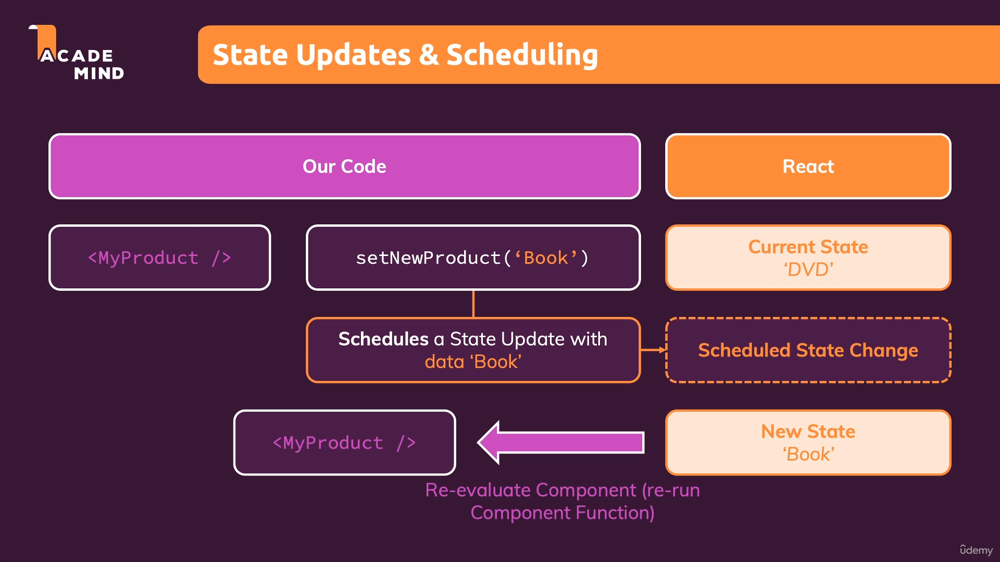
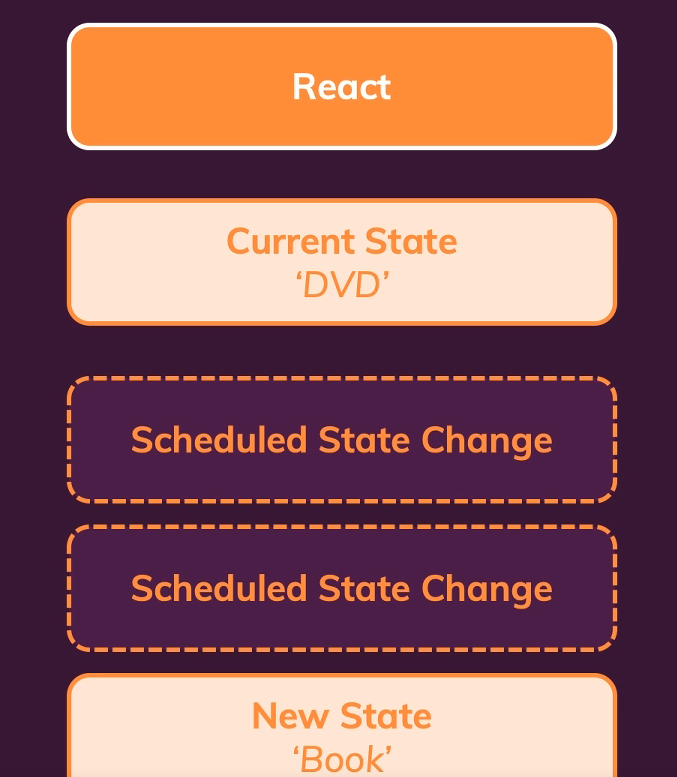

# State Scheduling dan Batching

## A. State Scheduling

Ada suatu hal yang perlu kita ketahui tentang proses mengupdate suatu state yaitu adalah state updates itu tidak terjadi secara instant tetapi `React melakukan schedule untuk mengupdate state tersebut`.



Bisa kita lihat dari ilustrasi diatas semisal pada component `My Product` kita mempunyai state bernama NewProduct dengan nilai default awal 'DVD'. Kemudian kita melakukan suatu update `setNewProduct` dengan nilai `book`. Hal ini mungkin terlihat instan di tampilan browser kita tetapi sebenarnya dibalik layar React melakukan `schedule` untuk melakukan update state tersebut kemudian jika state tersebut sudah terupdate maka baru component tersebut akan melakukan re-render.

Contoh kasus yang mungkin kita temui ketika schedule update state tersebut tertunda adalah semisal kita memilik sebuah `input` dimana user sedang mengisi nya. Karena prioritas input tersebut mungkin saja lebih tinggi daripada mengupdate hanya sebuah text dengan state tersebut. Maka bisa saja `schedulenya tertunda, tetapi React memastikan bahwa state tersebut akan terjadi.`

### 1. Previous State untuk mendapatkan state paling terakhir

Kita sudah mengetahui bahwa state melakukan scheduling untuk melakukan update maka bisa saja terjadinya multiple schedule update seperti dibawah ini:



Maka dari itu sangat dianjurkan menggunakan bentuk update seperti dibawah ini, `jika kita memerlukan previousState untuk nilai baru state kita`:

```ts
setNewProduct((prevProduct) => prevProduct + '2');
```

Form diatas menjamin state kita adalah yang terbaru sebelum kita update kembali.

### 2. useEffect Dependencies dengan state

Selain itu kita juga sudah mulai menggunakan useEffect, ketika kita melakukan setUpdate suatu state menggunakan useEffect dan memberikan state tersebut sebagai dependencies nya. `React sudah menjamin setiap ada nya perubahan state tersebut maka useEffect function didalamnya akan selalu jalan`.

```ts
useEffect(() => {
    setFormIsValid(emailIsValid && passwordIsValid);
}, [emailUsValid, passwordIsValid])
```

## B. State Batching

Kita sudah mengetahui bahwa ketika kita melakukan update pada state maka React akan melakukan suatu schedule update, tetapi mari kita lihat code dibawah ini:

```ts
const navigateHandler = (navPath) => {
    setCurrentNavPath(navPath);
    setDrawerIsOpen(false);
}
```

Kita bisa lihat code diatas kita membuat dua update state changes dengan line yang berurutan, jika kita menuliskan dalam suatu function dan kita melakukan update state berurutan seperti ini maka React akan melakukan suatu hal yang bernama `batching` yaitu dimana `Scheduled state change` pada ilustrasi diatas akan dilakukan sekali saja. `Jadi re-evaluate dan re-render tidak terjadi dua kali karena dua update state tetapi hanya terjadi sekali.`

### [Back To React Index](../../README.md)


