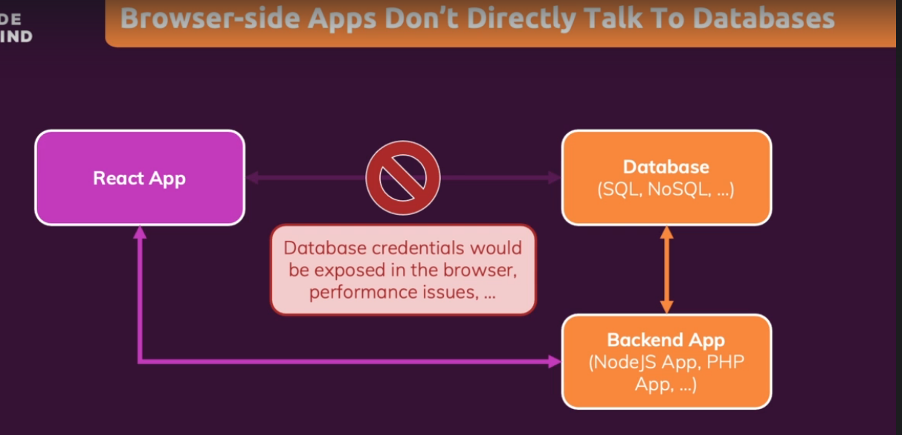

# Bagaimana cara connect ke sebuah Database

Dalam React ataupun framework front apapun sebenarnya tidak disarankan untuk melakukan komunikasi langsung terhadap database. Hal ini dikarenakan jika kita melakukan komunikasi langsung dengan database maka credentials database kita akan bisa dilihat melalui `developer tool` pada browser meliputi code kita cara terhubung dengan database tersebut.

Maka dari itu kita menggunakan media tengah yaitu sebuah `Backend App` dimana dia yang bertugas untuk melakukan komunikasi dengan database dan menyimpan credentials kita.

### [Back To React Index](../../README.md)

