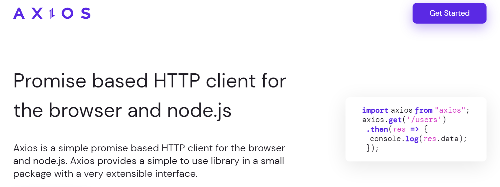
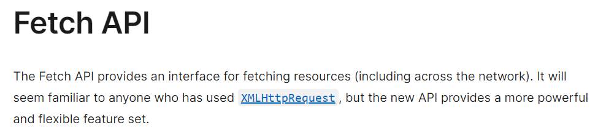

# Mengirim GET Request

Untuk melakukan GET Request biasanya kita menggunakan sebuah library bernama `axios`.



Tetapi untuk kali ini kita menggunakan sebuah function built-in browser bernama `fetch`



## Contoh Penggunaan Fetch

```ts
    const [movies, setMovies] = useState([]);

    function fetchMoviesHandler() {
        fetch('https://swapi.dev/api/films/')
        // Karena fetch bersifat promise kita bisa berikan then, catch and finally.
        .then((response) => {
            // Kita melakukan convert response dari fetch menjadi json
            return response.json();
        })
        // Karena hasil convert juga bersifat promise maka kita bisa menambahkan then kembali dengan menerima data nya
        .then((data) => {
            const transformedMovies = data.results.map(movieData => {
            return {
                id: movieData.episode_id,
                title: movieData.title,
                openingText: movieData.opening_crawl,
                releaseDate: movieData.release_date,
            };
            });
            setMovies(transformedMovies);
        });
    };
```

### [Back To React Index](../../README.md)

