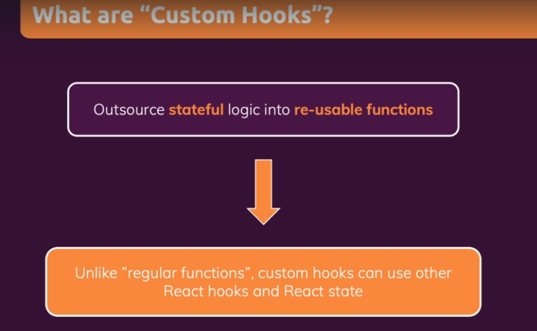

# Apa itu Custom Hooks ?

Custom hooks sebenarnya adalah function biasa dalam javascript, perbedaannya adalah didalam functions tersebut kita bisa menggunakan semua React Hooks yang tersedia seperti useState, usReducer, useEffect dan lain-lain. Penggunaan Hooks dasar React ini dalam function custom hook membuat kita dapat menggunakan `stateful logic` yang membuat function tersebut dapat kita gunakan berkali-kali dalam semua komponen yang kita pakai.

### [Back To React Index](../../README.md)

