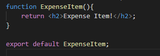

# Custom Component

Kita sudah mengenal bahwa konsep berputar pada React. Jadi bagaimana cara agar kita membuat custom component milik kita sendiri ?

Yang pertama kita membuat folder baru pada folder src yaitu bernama `components` pada folder ini kita akan meletakkan semua custom components milik kita.

## A. Peraturan pada Custom Components

### 1. Naming Convention Pada Custom Components

Penamaan custom component menggunakan Pascal Case dikarenakan untuk membedakan tag HTML asli dan tag dari custom component yang dibuat.

### 2. Satu Root Component

Jika custom component memiliki banyak tag html maka dibutuhkan satu root element yang sama yang menaungi semua tag html tersebut.

Solusi yang bisa dilakukan adalah dengan menambah div untuk menaungi semua tag html dan pada return diberikan syntax `return ()` agar kita bisa memberitahu bahwa kita melakukan return terhadap satu components full.

## B. Langkah Pembuatan Custom Components

### 1. Penulisan Code Pada Custom Components

Penulisan code custom pada component sebenarnya sederhana yaitu sebuah function biasa yang memiliki return tag html.

### 2. Lakukan Export Component agar dapat dipakai di file lainnya.

Setelah penulisan code selesai jangan lupa lakukan export agar file tersebut dipanggil di file lainnya.

### 3. Lakukan Import Component pada file yang diinginkan.

Untuk melakukan import custom component kita bisa menggunakan syntax import nama custom component.

## C. Basic Styling Pada Custom Component

### 1. Pemberian Nama Class pada tag HTML

Seperti proses pemberian style pada html seperti umumnya kita harus memberikan nama class. Tetapi syntax pemberian class sedikit berbeda dengan html pada umumnya yaitu tidak menggunakan `classname` tetapi `className`. Hal ini terjadi dikarenakan tag html pada react tidak sepenuhnya adalah html biasa tetapi adalah sebuah jsx.

### 2. Import CSS kedalam custom component

Jika kita sudah memiliki file CSS, kita tinggal melakukan import kedalam custom component yang kita memiliki. Untuk melakukan import css sedikit berbeda dengan melakukan import custom components.

## D. Dynamic Data Custom Components

Pada penggunaan custom components nantinya pastinya kita tidak mungkin menggunakan data yang di `hard code`. Maka dari itu pastinya kita akan menggunakan data dinamis. Untuk menggunakan data dinamis tersebut kita bisa menggunakan syntax `{}` diantara tag HTML. Syntax tersebut bersifat spesial dikarenakan kita bisa menuliskan logic javascript apapu didalamnya. Contoh :

Contoh custom component yang menggunakan stored variable pada const local

## E. Passing Data Menggunakan "Props"

Kita sudah bisa menggunakan custom component kita berkali berkali (reusable) dan juga kita sudah bisa memberikan data dinamis untuk custom component kita. Tetapi masalahnya data dinamis yang kita berikan bersifat local berada pada custom component tersebut. Bagaimana kah agar kita bisa memberikan data dari luar custom component tersebut.

Maka dari itu diperkenalkan sebuah fitur yang bernama `Props (Properties)`. Props ini memungkinkan kita dapat melakukan passing data dari suatu component ke component lainnya. Props ini penulisannya sama seperti `attributes` pada tag html umumnya.

